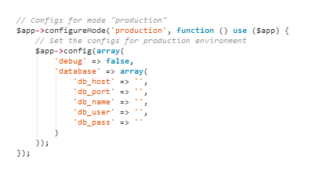

#phpstorm-theme-github-remixed-2

Get GitHub's syntax highlighting (color scheme and fonts) within PHPStorm.

In this theme I tried to be as close as
possible on the original GitHub PHP colours. This is the 2014 style (mostly black, cyan, orange and grey comments).
For the 2013 GitHub style (that one with the pink comments, you remember ?) please see my other repo
[phpstorm-theme-github-remixed](https://github.com/panique/phpstorm-theme-github-remixed).
The theme contains also basic colours for JS, HTML, CSS etc. and uses - exactly like GitHub - the `Consolas` font
which is installed by default on Windows systems and can be downloaded for free for Mac OS and Linux.
This is an experimental repo, not sure if this looks like it should look everywhere on every platform.

### Installation on Windows (PHPStorm 8)

Close PHPStorm if open.
Go to `C:\Users\XXXXXX\.WebIde80\config\colors` and place the .icls file there. Open PHPStorm, go to *View -> Quick Switch Theme -> Switch Color Scheme* and select *GitHub Remixed 2*.

### Installation on Mac OS (PHPStorm 8 - 2016.x)

Same as above, but path is `~/Library/Preferences/WebIde80/colors/` or in later versions `~/Library/Preferences/PhpStorm2016.x/colors/` (x is your minor version number). If the folder "colors" does not exist, simply add him. To find this folder, right click the finder, click "go to folder" and enter `~/Library`, you'll find your way. 

### Installation on Linux

For PHPStorm 8 path is `~/.WebIde80/config/colors/`, for PHPStorm 2016.X it's `~\.PhpStorm2016.X\config\colors`.

### Using PHPStorm 7, 9 or 10 ?

If you are using PHPStorm 7, 9 or 10 then the folder is `WebIde70`, `WebIde90` or `WebIde100` for sure.

### Problems ?

If you cannot see the new theme then please go to Settings > Editor > Colors & Fonts and try to save the current theme, which will make PHPStorm create a new file like `Default copy.icls` inside the theme folder. Don't know why, but somehow this triggers a rescan of the the theme folder, usually fixing any "theme not found" issues.

